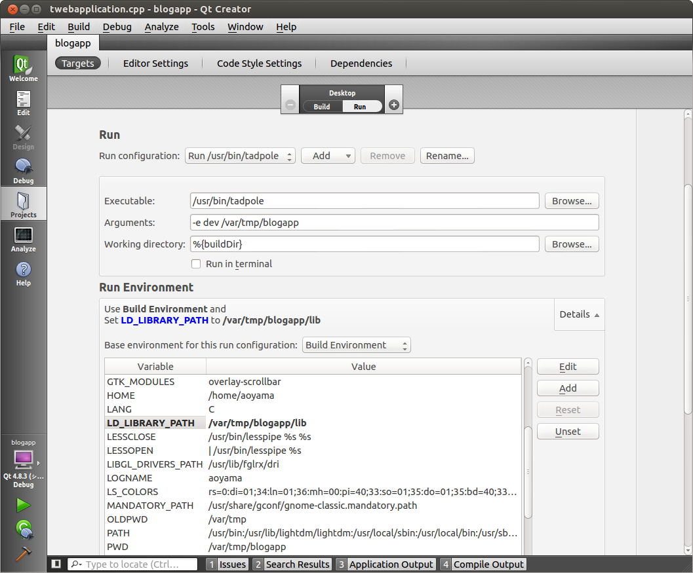
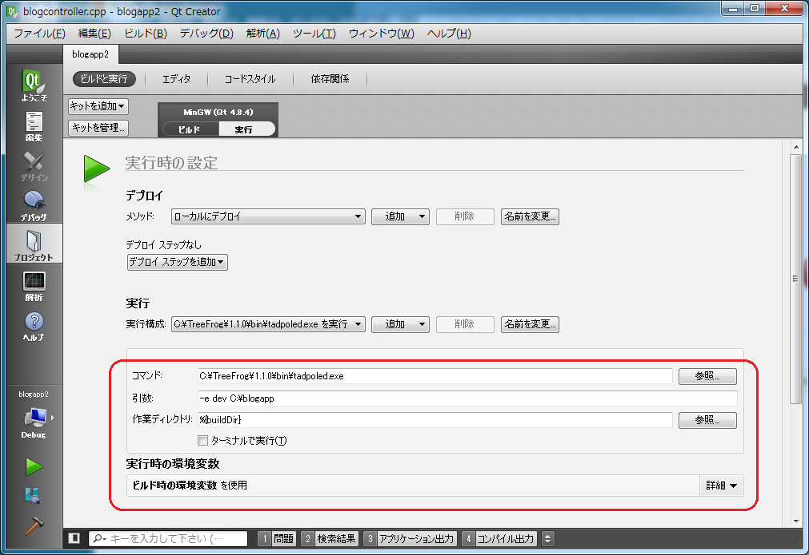

=====
Debug
=====

When you build the source code that you have created, four shared libraries are generated. These are the substance of the Web application. The TreeFrog application server (AP server) reads them on startup, then waits for access from a browser.

Debugging the Web app is equivalent to debugging the shared common libraries. First of all, let's compile the source code in debug mode. In the application root directory, you can run the following command.

.. code-block:: bash
  
  $ qmake -r "CONFIG+=debug"
  $ make clean
  $ make

In debug, the following settings are used according to the platforms.

In the case of Linux/ Mac OS X:

+------------------------------+-----------------------------------------------+
| Option                       | Value                                         |
+==============================+===============================================+
| Command                      | tadpole                                       |
+------------------------------+-----------------------------------------------+
| Command argument             | -e dev [Absolute path of the app root]        |
+------------------------------+-----------------------------------------------+
| LD_LIBRARY_PATH env variable | Specify the lib directory of web application. |
| (not needed on Mac OS X)     |                                               |
+------------------------------+-----------------------------------------------+

In the case of Windows:

+------------------------------+----------------------------------------------------------------------+
| Option                       | Value                                                                |
+==============================+======================================================================+
| Command                      | tadpoled.exe                                                         |
+------------------------------+----------------------------------------------------------------------+
| Command argument             | -e dev [Absolute path of the app root]                               |
+------------------------------+----------------------------------------------------------------------+
| PATH variable                | Add TreeFrog's bin directory C:\TreeFrog\x.x.x\bin at the beginning. |
|                              | Also, if you use something like MySQL or PostgreSQL, the directory   |
|                              | including the client DLL should also be added.                       |
+------------------------------+----------------------------------------------------------------------+
| TFDIR variable               | The TreeFrog directory is set, c:\TreeFrog\x.x.x.                    |
+------------------------------+----------------------------------------------------------------------+

- x.x.x is the version of TreeFrog.

Next we will configure these items.

Debugging with Qt Creator
-------------------------

Let’s introduce debugging using the Qt Creator, I think the way you debug is basically the same with other debuggers.

First, make a thread in the :ref:`MPM <performance>` application configuration file.

.. code-block:: ini
  
  MultiProcessingModule=thread

Import the source code of the application file to Qt Creator. Then click [File] – [Open File or Project...] and then choose the project file on the file selection screen. Click the [Configure Project] button, and then import the project. The following the screen is seen when the blogapp project is imported.

.. image:: images/QtCreator-import.png
	:width: 800

Next is the run settings screen for debug.
The last of the tadpole command arguments, specifies -e option and the application route’s absolute path. You may remember that the -e option is the setting for switching the DB environment.  Let's assume you choose dev.
 
In the case of Linux :
In the next screen we choose */var/tmp/blogapp* as the application root.

In Windows :
We can set the content in two ways by building the configuration screen and by implementing the configuration screen.

Example of build configuration:    (sorry Japanese images..)

.. image:: images/QtCreator-build-settings-win.png
	:width: 800

And an example of run configuration:

That is all about the configuration settings.  
When adding a breakpoint to the source code, always try to access it from your Web browser.

Check the processing, does it stop at the breakpoint?
